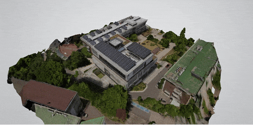
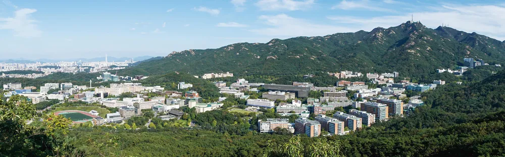
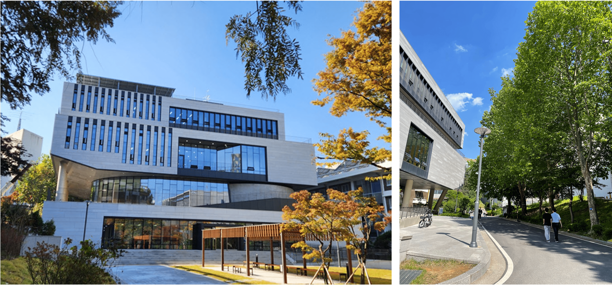
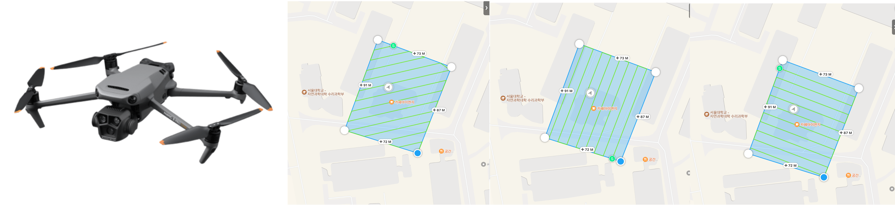
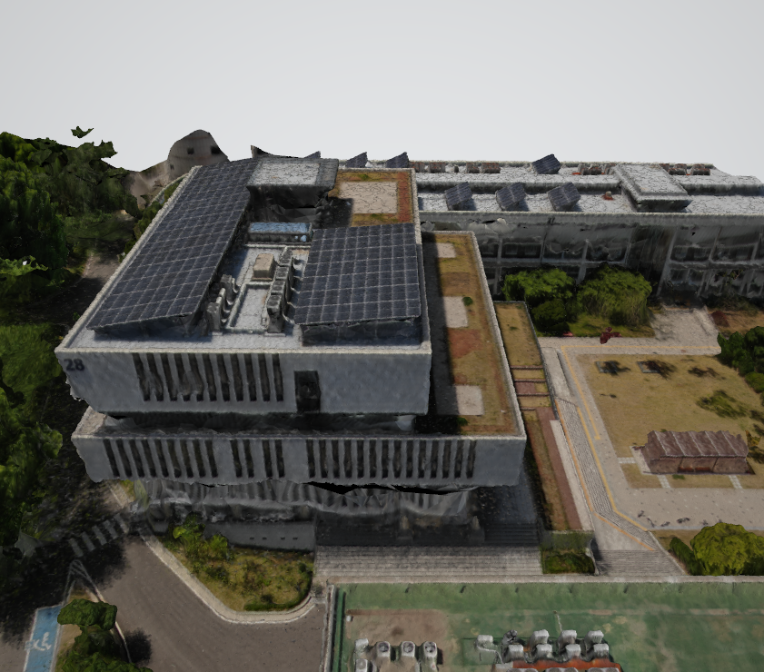

# Seoul National University Lecture Hall 3D Reconstruction

 

  

## Introduction

 

  

Seoul National University is situated in a mountainous area, surrounded by numerous natural obstacles, and its buildings are closely situated to each other, which poses significant challenges for photo-based 3D reconstruction. This project explores the conditions necessary for successful reconstruction and examines the current limitations of reconstruction technologies in such complex and densely built environments. Through this study, I aim to identify key factors that contribute to accurate reconstructions and understand the constraints of present-day methods.

 

  

  
    Target building: 28, Seoul National University
  

 

## Method
1. **Data Collection**

**Images**: 1,000 images were collected using a DJI Mavic 3 Pro drone. Both autonomic and manual flight paths were used to capture images from various angles and distances. The drone was flown at an altitude of 30m, with a 80% overlap between images.
  

    
  

 

2. **Reconstruction**

Used [Meshroom](https://github.com/alicevision/Meshroom), an open-source software, to reconstruct the 3D model. The software uses the Structure from Motion (SfM) algorithm to create a 3D model from the images.

 

  

  
    Meshroom 3D reconstruction
  

## Results

*	Although it is difficult to capture high-angle (aerial) shots due to limited coverage, expanding the shooting range and shooting angles as much as possible can overcome some challenges.

* When manually controlling drone, it is crucial to maintain continuity between images, which is difficult when obstacles such as trees and walls surround buildings. Maintaining continuity is challenging, and it becomes difficult to match features accurately between the automatic and manual shots, resulting in poor feature matching.

* The mismatch in continuity between automatic and manual captures poses an issue. To address this, would it be possible to merge reconstructions after using Point Cloud Registration?

 

  

  
    Reconstructed Mesh and Top view
  

 

  

  
    Front view
  

 

  

  
    Side view
  

**Improvement Suggestion**

 

  

One of the key challenges identified in this project is the loss of continuity in the reconstruction process due to obstacles obstructing the view. To address this issue, a potential solution is to separately reconstruct each obstructed area or surface and then merge these reconstructions using point cloud registration. This method would allow for a more complete and continuous 3D model by focusing on individual surfaces impacted by obstacles, followed by a careful alignment and integration with the overall model.
