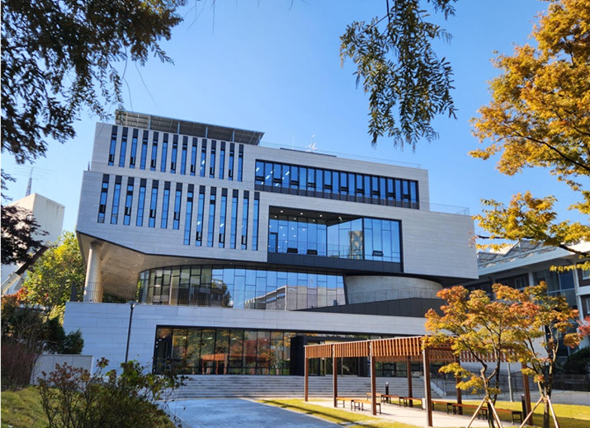
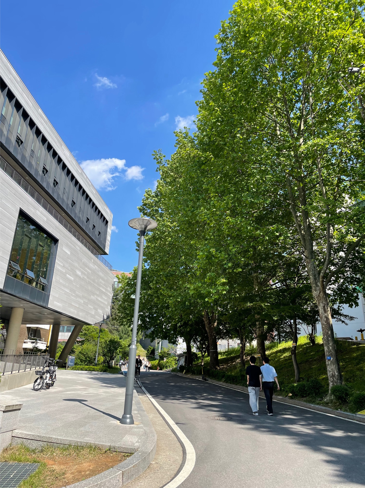
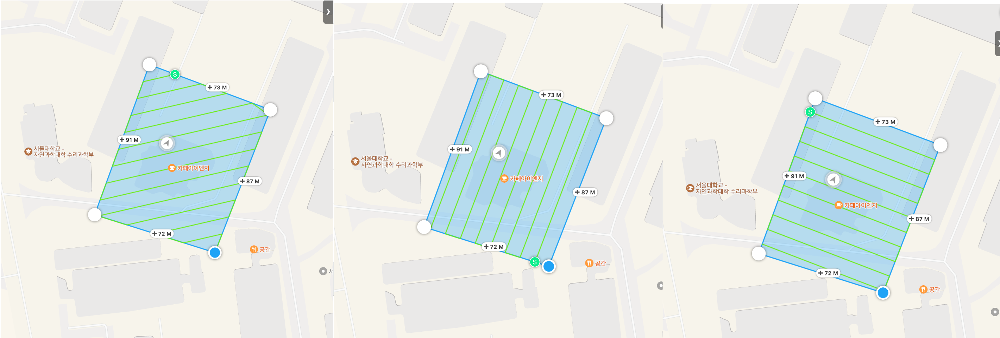
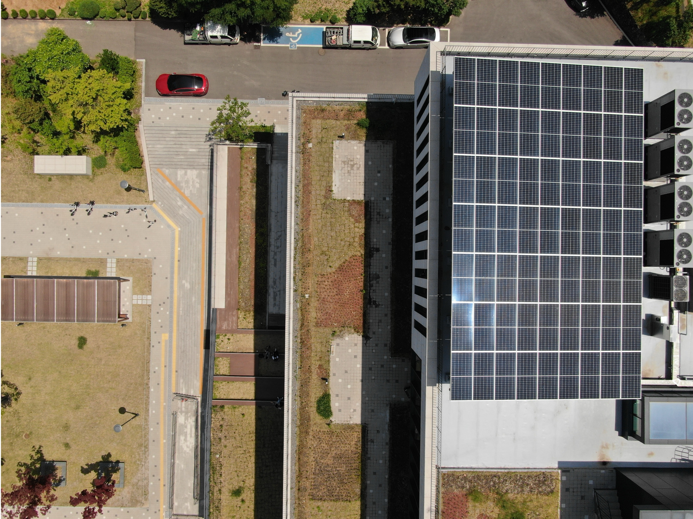
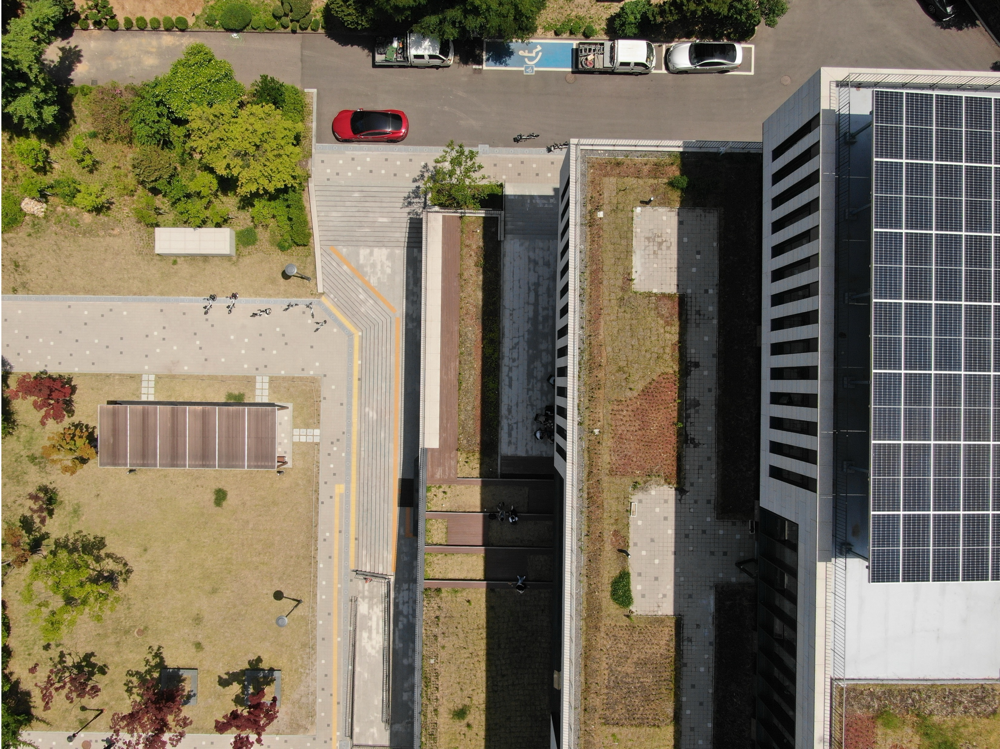
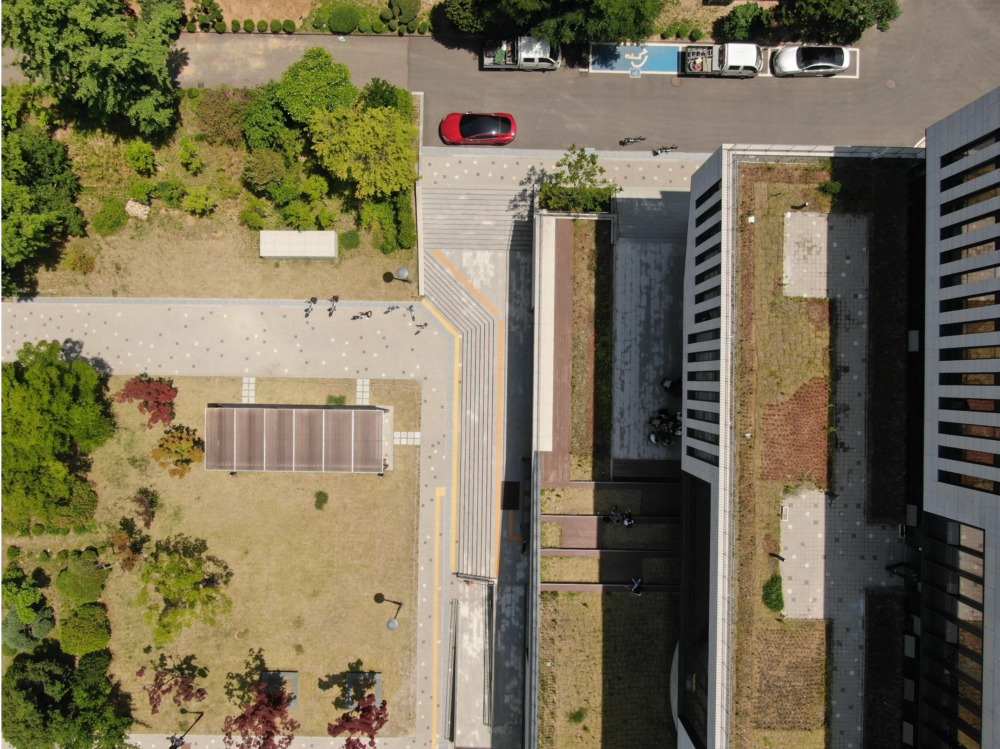
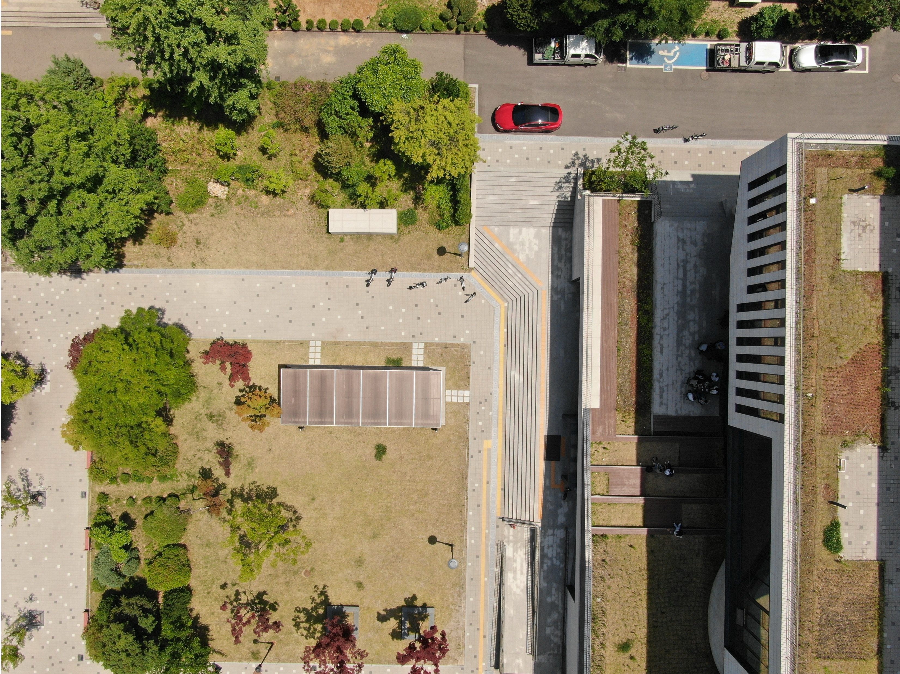
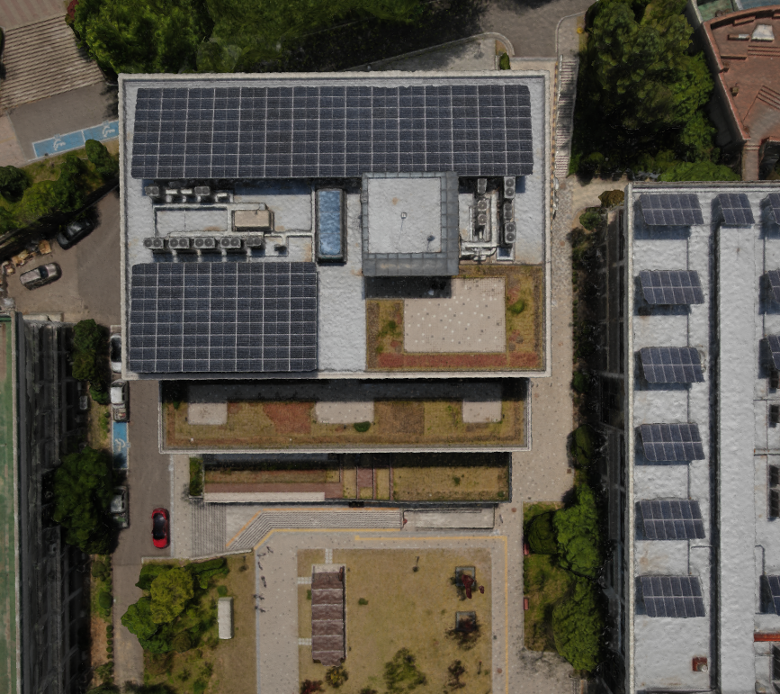

# Seoul National University Lecture Hall 3D Reconstruction

 

  

## Introduction

 

  

Seoul National University is situated in a mountainous area, surrounded by numerous natural obstacles, and its buildings are closely situated to each other, which poses significant challenges for photo-based 3D reconstruction. This project explores the conditions necessary for successful reconstruction and examines the current limitations of reconstruction technologies in such complex and densely built environments. Through this study, I aim to identify key factors that contribute to accurate reconstructions and understand the constraints of present-day methods.

 

  

  
    Target building: 28, Seoul National University
  

 

  

  
    Obstacles: Trees
  

## Method
1. **Data Collection**

**Images**: 1,000 images were collected using a DJI Mavic 3 Pro drone. Both autonomic and manual flight paths were used to capture images from various angles and distances. The drone was flown at an altitude of 30m, with a 80% overlap between images.

  

    
  

  

    
    
Autonomous drone flight path

  

    

        
    

    

        
    

    

        
    

    

        
    

 

2. **Reconstruction**

Used [Meshroom](https://github.com/alicevision/Meshroom), an open-source software, to reconstruct the 3D model. The software uses the Structure from Motion (SfM) algorithm to create a 3D model from the images.

 

  

  
    Meshroom 3D reconstruction
  

3. **Results**

 

  

  
    Reconstructed Mesh
  

 

  

  
    Top view
  

